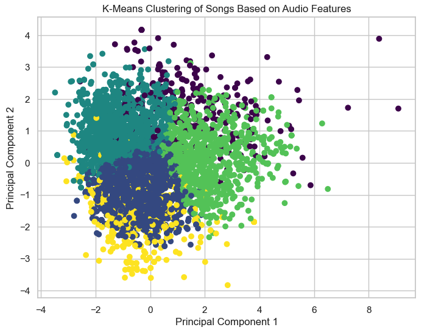

## DSC 530 Final Project – Exploratory Data Analysis of Spotify Tracks

This project explores relationships between audio features and musical genres using a public Spotify tracks dataset from Kaggle. The analysis includes exploratory data analysis, statistical hypothesis testing, regression modeling, classification using logistic regression, and clustering with k-means to examine patterns in musical characteristics across genres.

The work is implemented in a Jupyter Notebook using Python libraries such as pandas, matplotlib, seaborn, and scikit-learn. The dataset used for this project is included in this repository so the notebook can be executed without additional downloads.

### View the Notebook

You can view the full notebook with rendered outputs here:

[Open Notebook in nbviewer](NBVIEWER_LINK_HERE)

### Key Techniques

- Exploratory Data Analysis (EDA)
- One-way ANOVA hypothesis testing
- Linear regression
- Logistic regression classification
- K-means clustering

### Tools and Libraries

- Python
- pandas
- matplotlib
- seaborn
- scikit-learn
- Jupyter Notebook

### Example Visualization

